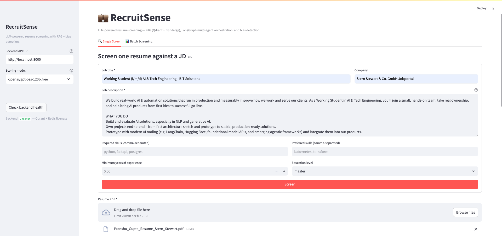
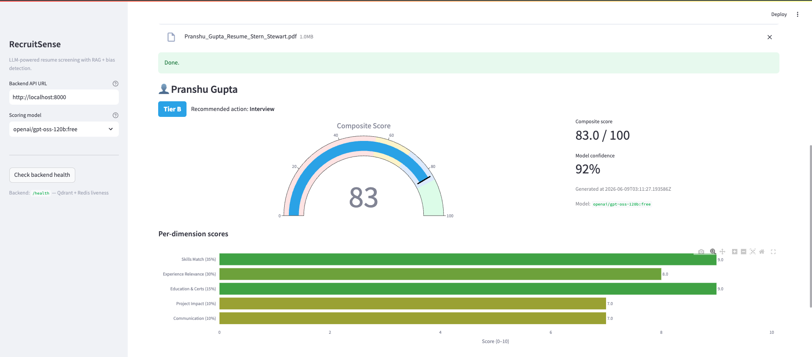
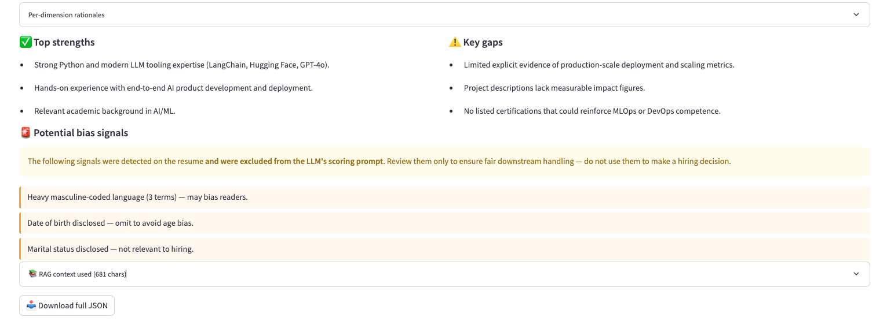

# RecruitSense

**LLM-powered resume screener with RAG, multi-agent orchestration, bias detection, and a local-first QLoRA fine-tuning pipeline.**

[](https://github.com/Pranshu0204/RecruitSense/actions/workflows/ci.yml)


RecruitSense scores a candidate's resume against a job description on five weighted dimensions, returns a tier (A / B / C / D) with rationales, surfaces bias signals to the recruiter (without ever feeding them to the scorer), and runs in batch with bounded concurrency.

---

## Demo

**1. Submit a job description and a resume.** The recruiter fills in the JD, sets required/preferred skills and minimum experience, and uploads a PDF resume.



**2. Get a scored, tiered result.** A weighted composite (0–100), a tier (A/B/C/D), a recommended action, model confidence, and a per-dimension breakdown — all computed deterministically in code from the LLM's dimension scores.



**3. Review strengths, gaps, and bias signals.** Top strengths and key gaps are pulled from the model; bias signals (gender-coded language, age/marital disclosures) are detected separately and **excluded from the scoring prompt** — surfaced only so a recruiter can ensure fair downstream handling.



---

## Table of contents

- [Demo](#demo)
- [Highlights](#highlights)
- [Architecture](#architecture)
- [Quick start (Docker)](#quick-start-docker)
- [Quick start (local Python)](#quick-start-local-python)
- [API](#api)
- [Configuration](#configuration)
- [Fine-tuning (local-first)](#fine-tuning-local-first)
- [Project layout](#project-layout)
- [Development](#development)
- [Design notes](#design-notes)

---

## Highlights

- **Five-dimension weighted scoring** — `skills_match` (35%), `experience_relevance` (30%), `education_and_certs` (15%), `project_impact` (10%), `communication_and_polish` (10%). Composite is computed deterministically in code, not by the LLM.
- **RAG Fusion** over Qdrant + BGE-large-en-v1.5 (1024-dim) — three LLM-generated sub-queries merged with Reciprocal Rank Fusion (k=60).
- **LangGraph multi-agent DAG** — `parser → (rag ∥ bias) → scorer`, with the bias and RAG branches running in parallel.
- **Bias is decoupled from scoring** — the bias agent runs over the raw resume; flags are returned to the recruiter UI but **never** appear in the scorer prompt.
- **Redis-backed LLM cache** with prompt-version-busted keys; gracefully degrades to no-cache when Redis is unreachable.
- **Batch screening** — up to 50 resumes per request, gated by an `asyncio.Semaphore` so the LLM provider isn't overwhelmed; one bad PDF can't kill the batch.
- **Streamlit recruiter UI** with Plotly composite gauges, dimension bars, leaderboard, tier-distribution donut, and CSV export.
- **Local-first QLoRA fine-tuning** — auto-detects MPS / CUDA / CPU; never imports `bitsandbytes` on macOS.
- **Production hygiene** — structured JSON logs (`structlog`), Pydantic v2 schemas as the single source of truth, Docker Compose stack with health-checked dependencies, GitHub Actions CI (lint + tests + Docker build smoke).

---

## Architecture

```
                         ┌──────────────────────────┐
                         │  Streamlit recruiter UI  │
                         │  (Single + Batch tabs)   │
                         └────────────┬─────────────┘
                                      │ HTTP (multipart)
                                      ▼
                         ┌──────────────────────────┐
                         │  FastAPI backend         │
                         │  /screen  /batch  /health│
                         └────────────┬─────────────┘
                                      │
                  ┌───────────────────┴────────────────────┐
                  ▼                                        ▼
       ┌──────────────────┐                    ┌─────────────────────┐
       │ LangGraph DAG    │                    │  Redis (LLM cache)  │
       │                  │                    └─────────────────────┘
       │  parse  ──┐      │
       │   │       │      │                    ┌─────────────────────┐
       │   ▼       ▼      │  ◀── retrieves ──▶ │  Qdrant + BGE-large │
       │  rag    bias     │                    │  (RAG Fusion, k=60) │
       │   │       │      │                    └─────────────────────┘
       │   ▼       ▼      │
       │  ┌───────────┐   │                    ┌─────────────────────┐
       │  │  scorer   │   │  ◀── completion ─▶ │  OpenRouter LLM     │
       │  └─────┬─────┘   │                    └─────────────────────┘
       └────────┼─────────┘
                ▼
        ScoreOutput JSON
```

Bias flags are surfaced alongside the score but **never** enter the scorer prompt.

---

## Quick start (Docker)

```bash
git clone https://github.com/Pranshu0204/RecruitSense.git
cd recruitsense

cp .env.example .env
# edit .env and set OPENROUTER_API_KEY

docker compose up --build -d

# Seed the RAG knowledge base (one-off)
docker compose exec backend python -m backend.rag.ingest --recreate
```

Then open:
- **Frontend** — http://localhost:8501
- **API docs** — http://localhost:8000/docs
- **Health** — http://localhost:8000/health

The backend image pre-downloads the BGE-large embedding model at build time, so the first request doesn't pay the ~2 GB download cost. Pass `--build-arg WARM_EMBEDDER=false` if you'd rather lazy-load it.

---

## Quick start (local Python)

```bash
# 1. Install backend deps
make install

# 2. Bring up Qdrant + Redis (Docker is fine; or run them natively)
docker compose up -d qdrant redis

# 3. Configure environment
cp .env.example .env
# edit OPENROUTER_API_KEY

# 4. Seed the vector store
make ingest

# 5. Run the API
make run        # → http://localhost:8000

# 6. In another shell, run the UI
make install-frontend
make frontend   # → http://localhost:8501
```

---

## API

### `POST /screen` — single resume

Multipart form:
- `jd_json` (string) — JSON-serialized `JDInput`
- `resume` (file) — candidate PDF

```bash
curl -X POST http://localhost:8000/screen \
  -F "jd_json={\"job_title\":\"Senior Python Engineer\",\"description\":\"...\",\"min_experience_years\":5}" \
  -F "resume=@./resume.pdf"
```

Returns a `ScoreOutput`:

```json
{
  "candidate_name": "Jane Smith",
  "composite_score": 82.5,
  "tier": "B",
  "dimension_scores": {
    "skills_match": {"score": 8.5, "rationale": "..."},
    "experience_relevance": {"score": 8.0, "rationale": "..."},
    "education_and_certs": {"score": 7.5, "rationale": "..."},
    "project_impact": {"score": 8.0, "rationale": "..."},
    "communication_and_polish": {"score": 8.0, "rationale": "..."}
  },
  "top_strengths": ["..."],
  "key_gaps": ["..."],
  "bias_flags": ["Graduation year disclosed — consider omitting (age proxy)."],
  "recommended_action": "interview",
  "rag_context_used": "[score=0.92] ...",
  "confidence": 0.88
}
```

### `POST /batch` — many resumes

Same request shape but with multiple `resumes` files (up to 50). Returns a `BatchResult` with a sorted leaderboard and tier distribution. Per-file failures degrade to a tier-D placeholder rather than failing the whole batch.

### `GET /health`

Returns `200` always; body indicates `ok` or `degraded` with per-dependency status:

```json
{ "status": "ok", "qdrant": true, "redis": true }
```

Full OpenAPI / Swagger UI at `http://localhost:8000/docs`.

---

## Configuration

All config is loaded via `pydantic-settings` from environment variables or `.env`. See `.env.example` for the full list.

| Variable                | Default                              | Notes |
|-------------------------|--------------------------------------|-------|
| `OPENROUTER_API_KEY`    | _(required)_                         | OpenRouter routes to any supported LLM. |
| `OPENROUTER_BASE_URL`   | `https://openrouter.ai/api/v1`       | |
| `DEFAULT_MODEL`         | `openai/gpt-oss-120b:free`           | Override per-call from the UI. Must be a free-tier OpenRouter model. |
| `QDRANT_HOST` / `_PORT` | `localhost` / `6333`                 | |
| `QDRANT_COLLECTION`     | `recruitsense_knowledge`             | |
| `REDIS_HOST` / `_PORT`  | `localhost` / `6379`                 | Optional — degrades gracefully to no-cache. |
| `REDIS_TTL_SECONDS`     | `3600`                               | LLM response cache TTL in seconds. |
| `LOG_LEVEL`             | `INFO`                               | |

---

## Fine-tuning (local-first)

Two additional env vars apply only to this pipeline (not needed for the screener itself):

| Variable | Default | Notes |
|---|---|---|
| `FINETUNE_BASE_MODEL` | `mistralai/Mistral-7B-Instruct-v0.3` | Base model pulled from HF Hub. |
| `MLFLOW_TRACKING_URI` | `http://localhost:5000` | Optional — metrics log silently if unreachable. |

The pipeline is designed to run on three host flavors **without code changes**:

| Device | Strategy |
|--------|----------|
| CUDA + `bitsandbytes` installed | 4-bit NF4 QLoRA + paged 8-bit AdamW (lowest VRAM) |
| CUDA bare                       | bf16 LoRA |
| **MPS (Apple Silicon)**         | fp16 LoRA — `bitsandbytes` is **never imported** |
| CPU                             | fp32 LoRA — for smoke tests only |

`bitsandbytes` is commented out of `finetune/requirements.txt` because it has no working build for macOS / MPS. Uncomment it on a CUDA host.

### 1. Build the dataset

```bash
make install-finetune
python -m finetune.prepare_dataset --max-samples 2000 --val-frac 0.1
```

This pulls [`AzharAli05/Resume-Screening-Dataset`](https://huggingface.co/datasets/AzharAli05/Resume-Screening-Dataset) from the HF Hub, synthesizes a JD per resume category, and emits a heuristic-derived `ScoreOutput` target per row. The fine-tune teaches the base model the **shape and style** of the scoring output — it is an instruction-format conditioner, not a ground-truth distillation.

Outputs land in `finetune/dataset/data/{train,val}.jsonl` as one chat-message list per line.

### 2. Train

```bash
# Quick local smoke test on a Mac (1B model, 200 steps):
python -m finetune.train \
  --base-model meta-llama/Llama-3.2-1B-Instruct \
  --max-steps 200 --per-device-batch-size 1

# Full run on a CUDA box:
python -m finetune.train --num-epochs 3
```

Each run writes its LoRA adapter, tokenizer, and a `manifest.json` to `finetune/runs/<UTC-timestamp>/`. Training metrics stream to MLflow if a tracking server is reachable; otherwise the run continues silently.

### 3. Evaluate

```bash
python -m finetune.evaluate \
  --base-model meta-llama/Llama-3.2-1B-Instruct \
  --adapter-dir finetune/runs/<timestamp>/adapter \
  --max-samples 100
```

Reports four families of metrics:

- **JSON-parse rate** — % of generations that survive `json.loads` and a `ScoreOutput` round-trip. The single most important number for a structured-output fine-tune.
- **Per-dimension MAE** — mean absolute error of each 0–10 score vs. reference.
- **Composite MAE & tier accuracy** — error on the aggregate 0–100 score and how often the predicted tier (A/B/C/D) matches.
- **ROUGE-L & BLEU-1** — surface-level rationale similarity.

Metrics also write to `eval_metrics.json` next to the adapter.

---

## Project layout

```
recruitsense/
├── backend/
│   ├── api/
│   │   ├── main.py                # FastAPI app, CORS, structured logging middleware
│   │   └── routes/                # /health, /screen, /batch
│   ├── agents/
│   │   ├── parser_agent.py        # JD/resume extraction + skill inference
│   │   ├── rag_agent.py           # RAG Fusion + RRF + JD enrichment
│   │   ├── bias_agent.py          # Pure regex/keyword, no LLM, decoupled from scorer
│   │   ├── scorer_agent.py        # JSON-only output with deterministic composite math
│   │   └── graph.py               # LangGraph DAG: parser → rag ∥ bias → scorer
│   ├── core/
│   │   ├── config.py              # pydantic-settings singleton
│   │   ├── prompts.py             # ChatPromptTemplates + PROMPT_VERSION
│   │   └── schemas.py             # Pydantic v2 — single source of truth
│   ├── rag/
│   │   ├── embedder.py            # BGE-large-en-v1.5 with BGE query instruction
│   │   ├── vector_store.py        # Qdrant client wrapper (cosine, 1024-dim)
│   │   └── ingest.py              # Skill-taxonomy → vector store
│   ├── utils/
│   │   ├── logger.py              # structlog JSON renderer
│   │   ├── pdf_parser.py          # PyMuPDF
│   │   └── redis_cache.py         # @cache_llm decorator (sync + async)
│   └── Dockerfile
├── frontend/
│   ├── app.py                     # Streamlit single + batch tabs, Plotly charts
│   └── Dockerfile
├── finetune/
│   ├── prepare_dataset.py         # AzharAli05/Resume-Screening-Dataset → JSONL
│   ├── train.py                   # TRL SFTTrainer + PEFT, auto device detection
│   ├── evaluate.py                # JSON-parse, MAE, tier acc, ROUGE-L, BLEU-1
│   └── mlflow_utils.py            # No-op fallback when tracking server is down
├── data/
│   ├── skill_taxonomy.json        # 32 roles → ingested as ~190 RAG chunks
│   └── sample_pairs.json          # JD/resume pairs used for RAG seeding
├── tests/                         # pytest, hermetic (no network or Docker needed)
├── .github/workflows/ci.yml       # ruff + pytest + Docker build smoke
├── docker-compose.yml             # qdrant + redis + backend + frontend
├── Makefile
└── pyproject.toml                 # ruff + pytest config
```

---

## Development

```bash
make install        # backend deps
make lint           # ruff check
make format         # ruff format
make test           # pytest

# One-shot quality gate:
make lint && make test
```

The test suite is hermetic: external dependencies (LLM, Qdrant, Redis) are monkeypatched at the route boundary, so `pytest` runs cleanly on a fresh clone with no infra.

---

## Design notes

- **Composite scoring is deterministic.** The LLM only emits per-dimension `score` + `rationale`. The composite (and therefore the tier and recommended action) is computed in code from the published weights. This makes the math auditable and prevents the LLM from "hallucinating" a tier that contradicts its own dimension scores.
- **Bias is observed, never used.** The bias agent runs over the raw resume text and surfaces flags to the recruiter UI. The scorer prompt explicitly bans bias factors from influencing the score. This separation is enforced architecturally — `bias_flags` are added to `ScoreOutput` after scoring.
- **Cache keys include `PROMPT_VERSION`.** Editing a prompt automatically busts the cache without manual intervention.
- **Per-resume failure isolation.** In batch mode, a malformed PDF or pipeline exception produces a tier-D `ScoreOutput` with `confidence=0` rather than failing the whole request.
- **Direct-call pipeline for batch.** `run_pipeline` calls the agent functions directly (`asyncio.create_task` for the parallel rag/bias branches) instead of compiling a fresh LangGraph per resume — keeps batch latency dominated by the LLM, not graph orchestration overhead.

---

## License

MIT — see [LICENSE](LICENSE).
